# RNA-Seq-Reference-Based-Analysis-Workflow
### Biological Insights into Splicing Regulation in *Drosophila melanogaster*

## 🧬 Project Background
This project analyzes RNA-Seq data from *Drosophila melanogaster* cells to investigate the impact of the **Pasilla (PS)** gene. Pasilla is the fly homolog of the human splicing factors **NOVA1** and **NOVA2**. By depleting this gene via RNA interference (RNAi), we identified genes and pathways regulated by this specific splicing factor.

The pipeline processes raw sequencing reads (**FASTQ**) through to biological interpretation via **GO/KEGG Enrichment**.

---
## What I Did

I took raw RNA-Seq reads from 7 *Drosophila* samples (4 untreated, 3 *Pasilla*-depleted) and ran them through a full pipeline: quality control → mapping → read counting → differential expression analysis → functional enrinchment of DE genes.

**Samples used:**

| Sample | Condition | Type |
|--------|-----------|------|
| GSM461176 | Untreated | Single-end |
| GSM461177 | Untreated | Paired-end |
| GSM461178 | Untreated | Paired-end |
| GSM461182 | Untreated | Single-end |
| GSM461179 | Treated (PS depleted) | Single-end |
| GSM461180 | Treated (PS depleted) | Paired-end |
| GSM461181 | Treated (PS depleted) | Paired-end |

---

## Results

### 1. Quality Control (MultiQC)

All 4 FASTQ files (subsampled) passed quality checks. Read length was **37 bp** across all samples.

| Sample | Total Reads | % Duplicates | % GC |
|--------|------------|-------------|------|
| GSM461177 forward | 1.1 M | 23.6% | 55% |
| GSM461177 reverse | 1.1 M | 25.2% | 55% |
| GSM461180 forward | 1.2 M | 23.7% | 56% |
| GSM461180 reverse | 1.2 M | 8.1% | 56% |

> The reverse reads of GSM461180 (treated sample) showed lower duplication and reduced quality at the 3' end - consistent with typical paired-end Illumina degradation.

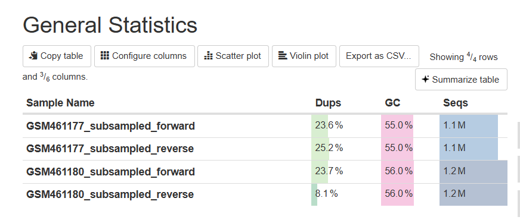

---

### 2. Read Counting (featureCounts)

After HISAT2 mapping, reads were assigned to *Drosophila* genes using featureCounts.

| Sample | Assigned Reads | Multi-mapping | Unassigned (no feature) |
|--------|---------------|---------------|------------------------|
| GSM461177 | 825,225 | 324,121 | 20,088 |
| GSM461180 | 843,496 | 273,323 | 14,778 |

> Multi-mapping reads (aligning to multiple genomic locations) were excluded from counts - standard practice in RNA-Seq analysis.

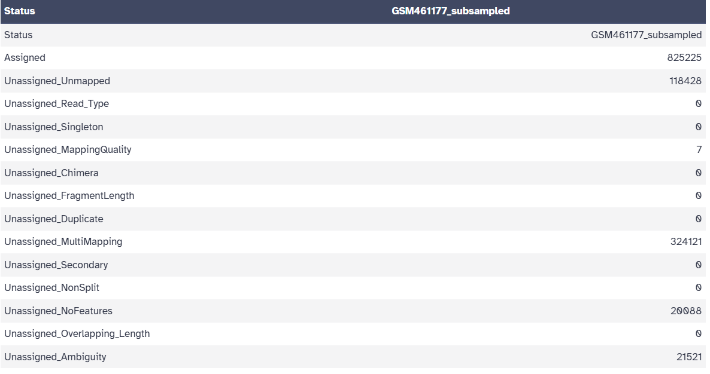

---

### 3. Differential Expression (DESeq2)

DESeq2 was run comparing **Treated vs Untreated**, with library type (SE/PE) included as a covariate to correct for batch effects.

**PCA Plot** - samples clearly separate by condition along PC1 (48% variance), confirming a strong treatment effect.

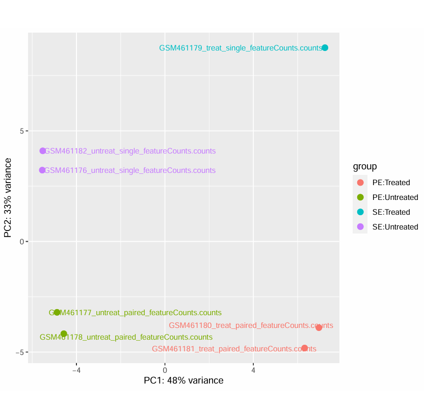

> PC1 separates treated from untreated. PC2 (33% variance) captures the single-end vs paired-end library difference, which is why including it as a covariate in the model matters.

---

**Sample-to-Sample Distance Heatmap** - untreated samples cluster together, treated samples cluster together, as expected.

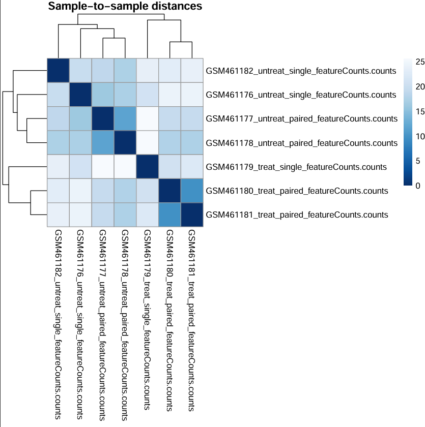

---

**Dispersion Estimates** - the fitted curve follows gene-level estimates well, indicating a good DESeq2 model fit for this dataset.

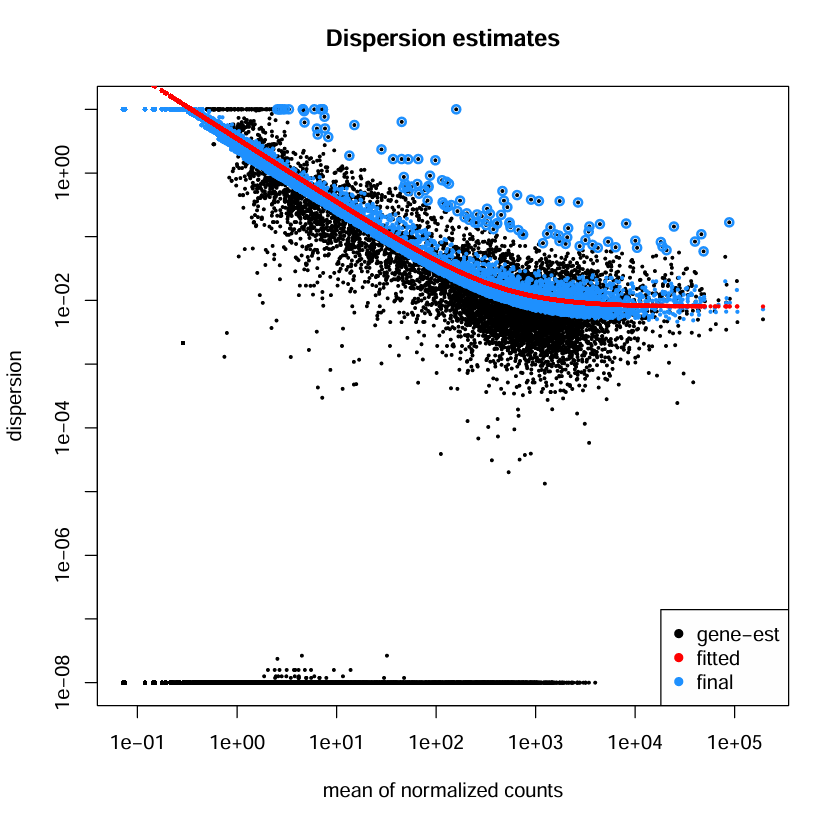

---

**MA Plot** - each dot is a gene. Red dots are significantly differentially expressed (padj < 0.05), spread across both up and down-regulation.

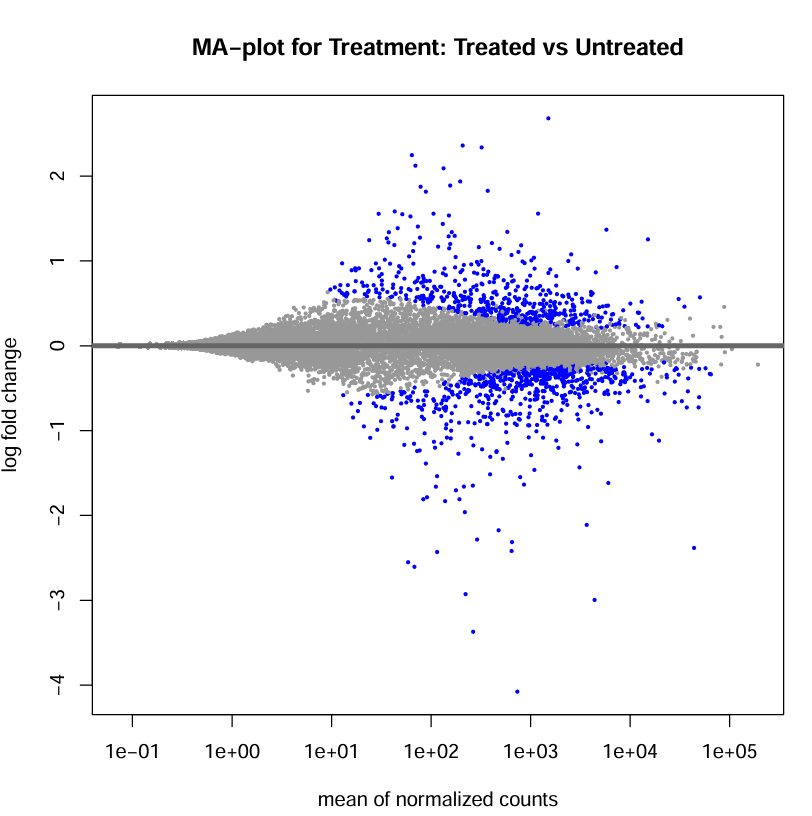

---

**P-value Histogram** - the spike near 0 confirms many truly DE genes. The flat background reflects non-DE genes — a healthy result.

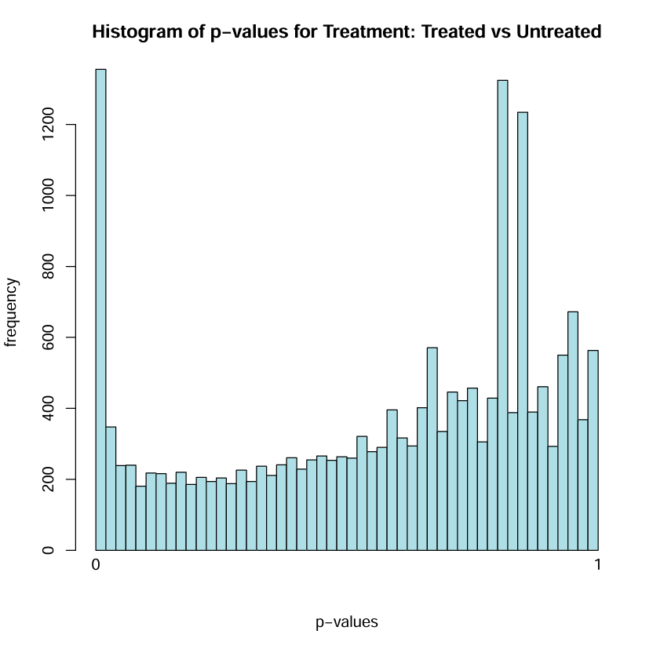

---

### 4. Differentially Expressed Genes

The final filtered DE gene list contains **24,317 entries** (FlyBase gene IDs with chromosome locations), distributed across all major *Drosophila* chromosomes (chrX, chr2L, chr2R, chr3L, chr3R).

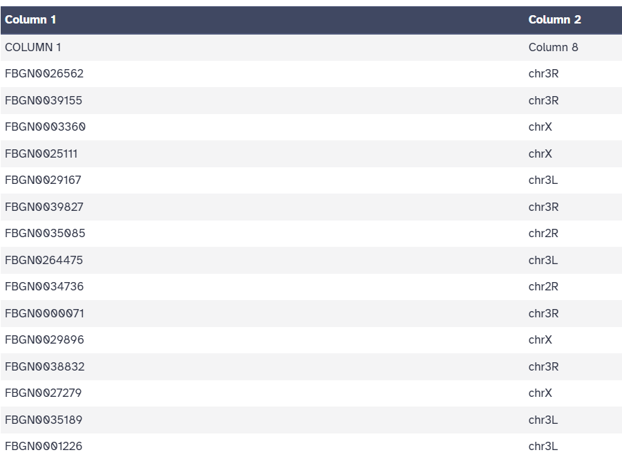

---

### 5. Genome Browser Visualization (IGV + JBrowse)

Mapped BAM files were loaded into IGV and Galaxy's JBrowse to visually inspect read alignments and splice junctions over the *Drosophila* genome (dm6).

**IGV - Overview (chr4:540,000–560,000)**

The region covers several genes including *zfh2*, *Thd1*, *lncRNA:CR43958*, and *Pur-alpha*. Three tracks are shown: coverage (top), splice junctions (arcs), and individual reads (bottom).

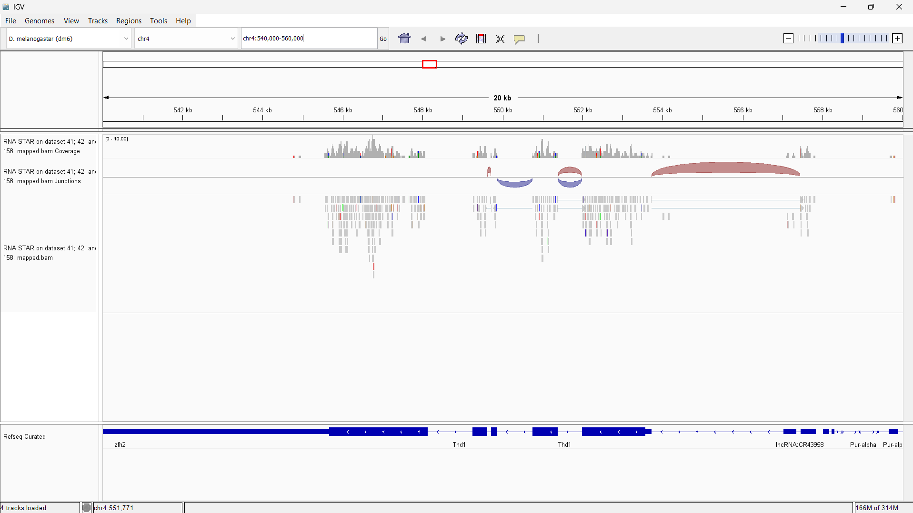

> The arc-shaped junctions confirm that HISAT2 successfully detected spliced alignments — reads spanning across introns and mapping to two separate exons. This is the key feature of splice-aware mapping.

---

**IGV — Zoomed In (splice junctions)**

A closer view of the same region showing two clearly visible splice junction arcs (numbered 1 and 2) with high read coverage on the flanking exons and a drop in coverage over the intron - exactly the expected pattern for spliced RNA-Seq reads.

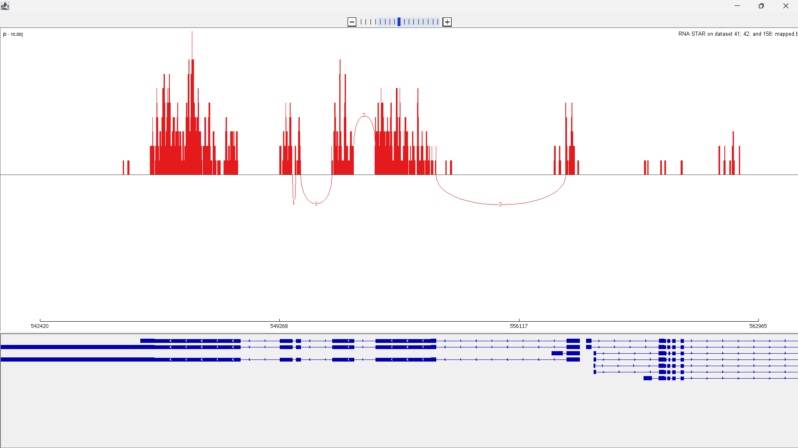

---

**JBrowse - Untreated vs Treated Comparison**

Galaxy's JBrowse showing all 4 tracks side by side over the *Thd1* gene region:
- **Red tracks** --> GSM461177 (untreated)
- **Blue tracks** --> GSM461180 (treated, *Pasilla* depleted)

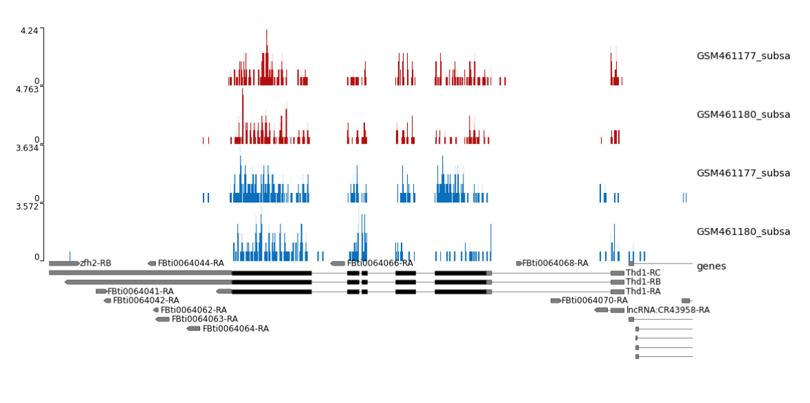

> The untreated sample (red) shows visibly higher coverage over *Thd1* exons compared to the treated sample (blue), consistent with *Thd1* being differentially expressed. The gene models (black exon blocks) at the bottom show the multiple transcript isoforms of *Thd1*.

---
### 6. Functional Enrichment Analysis (GOseq)

GOseq was run on the DE genes to identify over-represented biological functions,
accounting for gene-length bias inherent in RNA-Seq data.

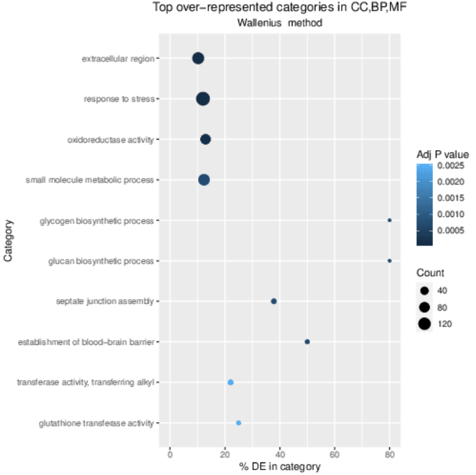

> The dot plot shows the top 10 over-represented GO categories across CC 
> (Cellular Component), BP (Biological Process), and MF (Molecular Function) 
> using the Wallenius method. Dot size = number of DE genes in that category, 
> color = adjusted p-value (darker = more significant).

Key enriched categories:
- **Glycogen & glucan biosynthetic process** — highest % of DE genes (~80%),
  suggesting metabolic reprogramming after *Pasilla* depletion
- **Establishment of blood-brain barrier & septate junction assembly** - points
  to structural/cellular organization changes
- **Response to stress & oxidoreductase activity** - among the most significant
  hits (darkest dots, adj p < 0.0005)
- **Glutathione transferase activity** = implicates detoxification pathways

## How to Reproduce

1. Go to [usegalaxy.eu](https://usegalaxy.eu) and create a new history
2. Import subsampled FASTQ files from [Zenodo](https://zenodo.org/record/6457007)
3. Run **Falco** → **MultiQC** → **Cutadapt** for QC
4. Map with **HISAT2** using the dm6 reference genome
5. Count reads with **featureCounts** (unstranded)
6. Run **DESeq2** - factor: Treatment (treated vs untreated), covariate: library type
7. Filter results: padj < 0.05

Full tutorial: https://training.galaxyproject.org/training-material/topics/transcriptomics/tutorials/ref-based/tutorial.html
